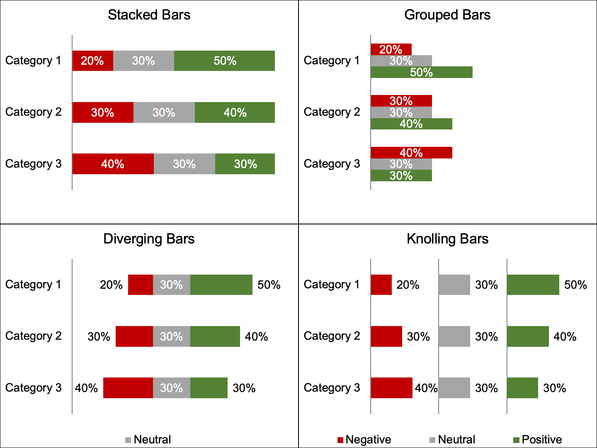
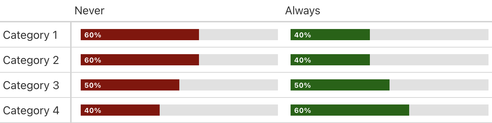
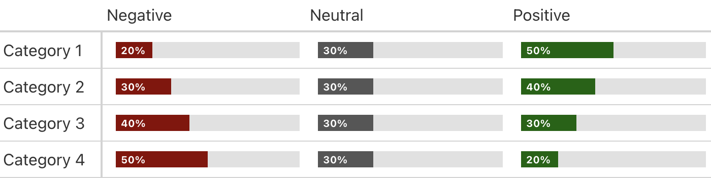
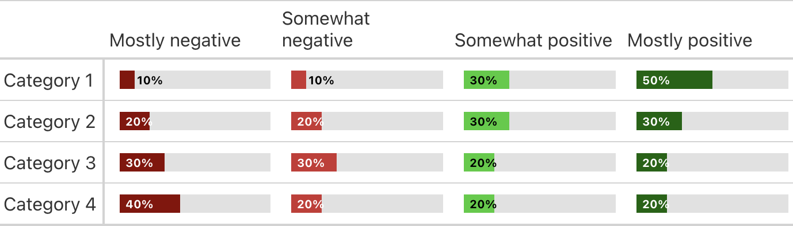
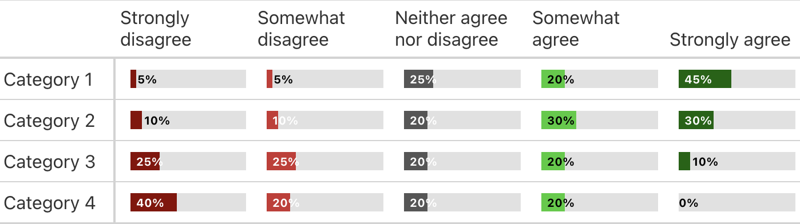

# Knolling
AJ Thurston

## Introduction

Originating from photography, knolling is the process of laying out
objects in a clean and tidy pattern. Knolling in data visualization is
an alternative to other bar charts where each response option occupies
its own axis, and each axis has a consistent width, to make for easier
and consistent comparisons across response options and groups.

## Comparison to other bar charts

Knolling offers some advantages over issues with other bar charts:

- Stacked bar charts are intuitive but can mask important response
  option differences as each response option can start as a different
  x-axis origin.

- Grouped bar charts force the data visualization maker to choose to
  compare either the group or the response options, but it is difficult
  to make comparisons across both.

- Diverging response option charts are less commonly used and can be
  complex to make. They also force the reader of the chart to interpret
  distance from the y-axis both left to right and right to left.



## Templates

### PowerPoint

For most use cases, I would actually recommend using the [PowerPoint
template](https://github.com/AJThurston/knolling/raw/main/knolling.pptx).
Note, there is a `buffer` or scaling factor that is designed to maximize
the width of each response option column while leaving a bit of space
for a data label, so if the label’s position isn’t to your liking,
adjust the buffer to your liking. Note, the knolling chart in PowerPoint
is just a stacked bar chart with blank columns, so if you need to add
more response options you will need to add more blank columns for a
consistent look, and may need to adjust the axis lines as well.

### R using {gtExtra}

For repeated, HTML-based applications, I’ve replicated what is provided
inthe PowerPoint using {gt} and {gtExtras} for 2, 3, 4, and 5 response
options below.

``` r
knitr::opts_chunk$set(eval = FALSE, echo = TRUE)
library(gt)
library(gtExtras)
library(tidyverse)
library(svglite)
library(ggplot2)
```

## Two Response Options

``` r
k2ro <-  tibble(
  Category = c("Category 1","Category 2", "Category 3", "Category 4"),
  Never = c(60,60,50,40),
  Always = c(40,40,50,60)
) 

k2ro %>%
  gt(rowname_col = "Category") %>%
  gt_plt_bar_pct(
    column = Never,
    width = 300,
    fill = "darkred",
    labels = TRUE,
    scaled = TRUE) %>%
  gt_plt_bar_pct(
    column = Always,
    width = 300,
    fill = "darkgreen",
    labels = TRUE,
    scaled = TRUE) %>%
  tab_options(table.width = pct(100))
```



## Three Response Options

``` r
k3ro <- tibble(
  Category = c("Category 1", "Category 2", "Category 3", "Category 4"),
  Negative = c(20, 30, 40, 50),
  Neutral = c(30, 30, 30, 30),
  Positive = c(50, 40, 30, 20)
)

k3ro %>%
  gt(rowname_col = "Category") %>%
  gt_plt_bar_pct(
    column = Negative,
    width = 200,
    fill = "darkred",
    labels = TRUE,
    scaled = TRUE) %>%
  gt_plt_bar_pct(
    column = Neutral,
    width = 200,
    fill = "#565656",
    labels = TRUE,
    scaled = TRUE) %>%
  gt_plt_bar_pct(
    column = Positive,
    width = 200,
    fill = "darkgreen",
    labels = TRUE,
    scaled = TRUE) %>%
  tab_options(table.width = pct(100))
```



## Four Response Options

``` r
k4ro <- tibble(
  Category = c("Category 1", "Category 2", "Category 3", "Category 4"),
  `Mostly negative` = c(10, 20, 30, 40),
  `Somewhat negative` = c(10, 20, 30, 20),
  `Somewhat positive` = c(30, 30, 20, 20),
  `Mostly positive` = c(50, 30, 20, 20)
) 

k4ro %>%
  gt(rowname_col = "Category") %>%
  gt_plt_bar_pct(
    column = `Mostly negative`,
    width = 150,
    fill = "darkred",
    labels = TRUE,
    scaled = TRUE) %>%
  gt_plt_bar_pct(
    column = `Somewhat negative`,
    width = 150,
    fill = "#CC3333",
    labels = TRUE,
    scaled = TRUE) %>%
  gt_plt_bar_pct(
    column = `Somewhat positive`,
    width = 150,
    fill = "#33CC33",
    labels = TRUE,
    scaled = TRUE) %>%
  gt_plt_bar_pct(
    column = `Mostly positive`,
    width = 150,
    fill = "darkgreen",
    labels = TRUE,
    scaled = TRUE) %>%
  tab_options(table.width = pct(100))
```



## Five Response Options

``` r
k5ro <- tibble(
  Category = c("Category 1", "Category 2", "Category 3", "Category 4"),
  `Strongly disagree` = c(5, 10, 25, 40),
  `Somewhat disagree` = c(5, 10, 25, 20),
  `Neither agree nor disagree` = c(25, 20, 20, 20),
  `Somewhat agree` = c(20, 30, 20, 20),
  `Strongly agree` = c(45, 30, 10, 0)
)

k5ro %>%
  gt(rowname_col = "Category") %>%
  gt_plt_bar_pct(
    column = `Strongly disagree`,
    width = 120,
    fill = "darkred",
    labels = TRUE,
    scaled = TRUE) %>%
  gt_plt_bar_pct(
    column = `Somewhat disagree`,
    width = 120,
    fill = "#CC3333",
    labels = TRUE,
    scaled = TRUE) %>%
  gt_plt_bar_pct(
    column = `Neither agree nor disagree`,
    width = 120,
    fill = "#565656",
    labels = TRUE,
    scaled = TRUE) %>%
  gt_plt_bar_pct(
    column = `Somewhat agree`,
    width = 120,
    fill = "#33CC33",
    labels = TRUE,
    scaled = TRUE) %>%
  gt_plt_bar_pct(
    column = `Strongly agree`,
    width = 120,
    fill = "darkgreen",
    labels = TRUE,
    scaled = TRUE) %>%
  tab_options(table.width = pct(100))
```


